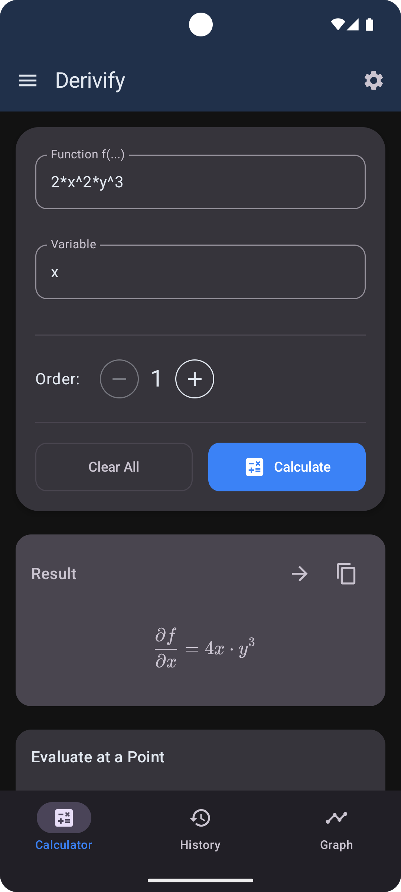
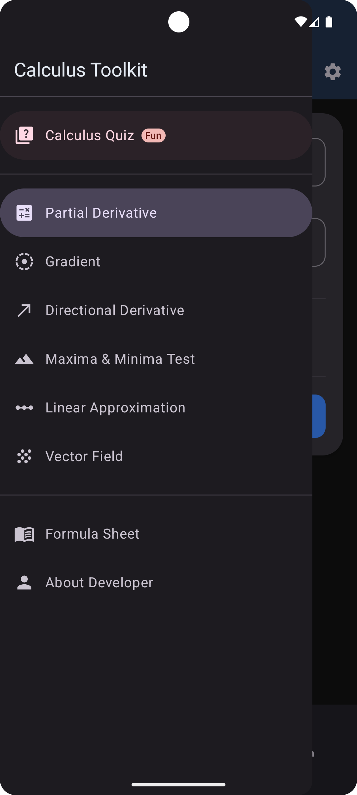
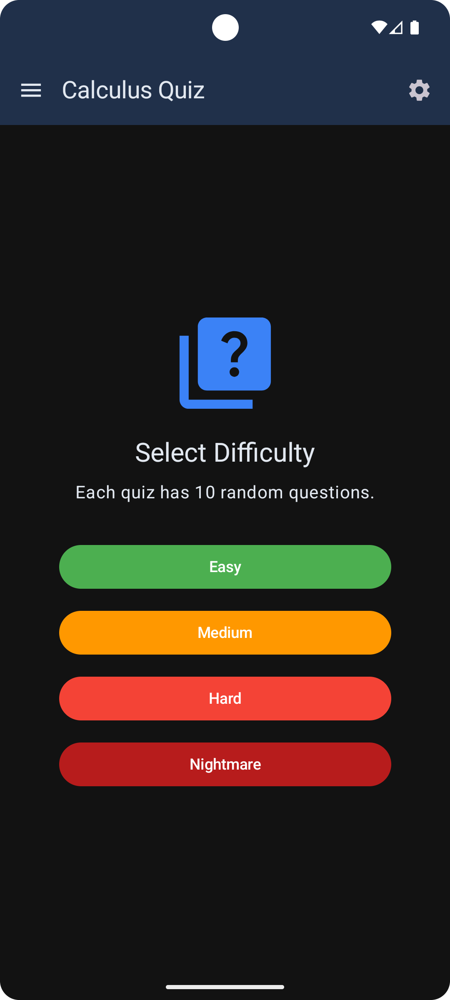
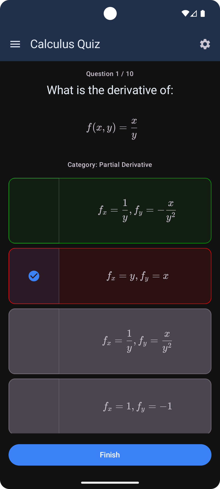

# Derivify: The Calculus Toolkit

This project began as a final assignment for my second-semester Multi-Variable Calculus course. The requirement was to build something related to our curriculum, but I saw it as an opportunity to build a truly useful, high-quality tool for other students.

**Derivify** is the result: a native Android application designed to be an all-in-one toolkit for university-level calculus. It's not just a calculator; it's a learning companion built with a modern tech stack—100% Kotlin and Jetpack Compose.

 

## What It Does

The app is built around two core ideas: providing powerful tools for solving problems and offering an interactive way to practice and test your knowledge.

### The Calculators

Derivify can handle a range of complex multi-variable calculus operations:
* **Partial Derivatives:** Solves partial derivatives for functions with multiple variables.
* **Gradients:** Instantly finds the gradient vector `∇f` of a function.
* **Directional Derivatives:** Calculates the rate of change in the direction of a given vector.

### The Calculus Quiz

To move beyond simple calculation, I built an interactive quiz feature with a large, university-level question bank. This is designed to genuinely test your understanding, not just your memorization.

It features four difficulty levels:
* **Easy:** A review of foundational rules (Power Rule, Product Rule, etc.).
* **Medium:** A mix of more complex chain rules, implicit differentiation, and inverse trig.
* **Hard:** This is where multi-variable topics begin, focusing on partial derivatives and gradients.
* **Nightmare:** A true challenge with mixed partials, directional derivatives, and other complex problems.

 

## Application Screenshots

| Calculator | Navigation Menu | Quiz Selection | Quiz in Progress |
| :---: | :---: | :---: | :---: |
|  |  |  |  |

 

## How It's Built

This project was an exercise in building a modern, robust Android application from the ground up.

* **Language:** 100% **Kotlin**.
* **User Interface:** **Jetpack Compose** with **Material 3** for a fully declarative, modern UI.
* **Architecture:** Follows the **MVVM (Model-View-ViewModel)** pattern to ensure a clean separation of concerns between the UI and the business logic.
* **State Management:** State is managed using `ViewModels` and `MutableState`, allowing the UI to react efficiently to data changes.
* **Math Engine:** Features a **custom-built symbolic differentiation engine**. It parses the user's function into an expression tree and recursively applies calculus rules (like the Power Rule, Product Rule, and Chain Rule) to find the exact analytical derivative.

 

## Download & Installation

The latest installable `.apk` file is available on the **Releases** page.

1.  Navigate to the [**Latest Release**](https://github.com/YOUR_USERNAME/YOUR_REPO/releases/latest).
2.  Under "Assets", download the `app-release.apk` file.
3.  Open the file on your Android device. You may need to grant permission to "install from unknown sources" if prompted.

 

## What's Next: The Future Roadmap

This project is still in active development. My goal is to build out the full suite of tools I wished I had in my course. The next priorities are:

* **Implement New Calculators:**
    * Maxima & Minima (Second Partial Derivative Test)
    * Linear Approximation & Tangent Planes
    * Vector Field Visualization
* **Step-by-Step Solutions:** Go beyond just the answer and show *how* the derivative was calculated.
* **3D Graph Plotting:** Add a feature to visualize the functions being analyzed.

 

## About Me

My name is **Mahad** (`codewithmahad`), and I'm a software developer and student passionate about building practical, well-designed applications. This project was a joy to build, combining my academic studies with my passion for mobile development.

* **LinkedIn:** [www.linkedin.com/in/codewithmahad](https://www.linkedin.com/in/codewithmahad)

 

## License

This project is licensed under the MIT License.

MIT License

Copyright (c) 2025 Shaikh Mahad 

Permission is hereby granted, free of charge, to any person obtaining a copy
of this software and associated documentation files (the "Software"), to deal
in the Software without restriction, including without limitation the rights
to use, copy, modify, merge, publish, distribute, sublicense, and/or sell
copies of the Software, and to permit persons to whom the Software is
furnished to do so, subject to the following conditions:

The above copyright notice and this permission notice shall be included in all
copies or substantial portions of the Software.

THE SOFTWARE IS PROVIDED "AS IS", WITHOUT WARRANTY OF ANY KIND, EXPRESS OR
IMPLIED, INCLUDING BUT NOT LIMITED TO THE WARRANTIES OF MERCHANTABILITY,
FITNESS FOR A PARTICULAR PURPOSE AND NONINFRINGEMENT. IN NO EVENT SHALL THE
AUTHORS OR COPYRIGHT HOLDERS BE LIABLE FOR ANY CLAIM, DAMAGES OR OTHER
LIABILITY, WHETHER IN AN ACTION OF CONTRACT, TORT OR OTHERWISE, ARISING FROM,
OUT OF OR IN CONNECTION WITH THE SOFTWARE OR THE USE OR OTHER DEALINGS IN THE
SOFTWARE.
